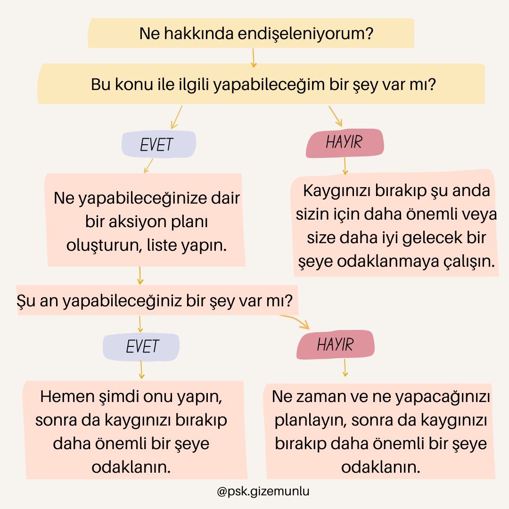

Kaygı bozukluğu toplumun yaklaşık yüzde 18’ini etkileyen, yaşayan kişinin sadece akıl sağlığını değil fiziksel sağlığını da olumsuz olarak etkileyebilen, hayat kalitesini düşüren ve potansiyeline erişmesini engelleyen ciddi bir psikolojik rahatsızlıktır. Aslında kaygı doğal ve ilkel bir korunma mekanizmasıdır. Kaygılanmak, hayati durumlarla karşılaşıldığında hızlı karar verebilmek ve günlük hayatta sorunlarla baş edebilmek için gereklidir. Her insan iş, okul, ailesel ve maddi problemler, veya sağlık sorunları sebebiyle kaygı duygusunu yaşayabilir. Ancak bazen kaygı, insan yaşamında problemli bir döngüye neden olup kendisi başlı başına bir sorun haline gelebilir. Eğer kaygı hayat kalitenizi düşürüyorsa, sizi günlük işlerinizi yapmaktan alıkoyuyorsa, şiddeti ve sıklığı kontrol edilemez hale geldiyse kaygı bozukluğu yaşıyor olabilirsiniz. Bunun için profesyonel bir psikolojik destek almanızı öneririm. Ancak ben bu yazıda tedaviye ya da terapiye destek olabilecek ve gün içinde yoğun kaygı hissettiğiniz anlarda size yardımcı olacak etkili üç yöntemden bahsetmek istiyorum.

## **1-Kaygılarınızı yazın (Kaygı Günlüğü Tekniği)**

Kaygılarınızla başa çıkmanın için en etkili yol onları aklınıza geldikleri an yakalayıp not etmektir. Örneğin, “Ya bugün toplantıda saçma bir şey söylersem?” “Ya kız arkadaşım beni terkederse o zaman ne yaparım?” “Ya oğlum okulunu bitiremezse?” gibi. Bunun için özel bir defter ayırabilirsiniz ya da bir kağıda da yazabilirsiniz. Hatta bazıları telefonlarındaki notlar kısmına yazmayı daha pratik bulabilir. Not etmek için nasıl bir yöntem bulursanız bulun, önemli olan yazmanız!

Aklınızdakileri yazmak zihninizi boşaltmanıza ve toparlamanıza yardımcı olur. Zihinde sanki çok yer kaplıyormuş gibi görünen düşüncelerin aslında yazıya geçtiğinde ne kadar basit ve küçük göründüğünü fark etmek kişiyi düşüncelere kapılıp gitmekten alıkoyar. Olaylara, düşüncelerimize ve duygularımıza uzaktan bakmamıza ve aramıza mesafe koymamıza yardımcı olur. Bu aslında bir çeşit farkındalık egzersizidir. Aklımızı meşgul eden düşüncelerimizi, bizi endişelendiren olayları , hissettiğimiz endişeyi ve korkuyu yazıya dökmek; bize, duygu ve düşüncelerimizden ibaret olmadığımızı, onlardan çok daha fazlası olduğumuzu farkettirir. Çünkü o anki duygu ve düşüncelerimiz gelip geçicidir.

Özellikle geceleri yatağa yattığınızda aklınızda sürekli kaygılı düşünceler dolaşıp sizi uyutmuyorsa bu teknik sizin için çok faydalı olabilir. Baş ucunuzda bir kağıt kalem bulundurup aklınıza gelen şeyi kısa bir cümleyle özetleyin, daha sonra da “Yarın bununla ilgili istediğim kadar düşünebilirim, ancak şu an bunu düşünmenin bana herhangi bir faydası yok. Şimdi uyuyup yarın berrak bir zihinle bu konuyla ilgili neler yapabileceğimi düşüneceğim.” diyerek uyumaya çalışın.

## **2-Kaygılarınızı sınıflayın (Kaygı Ağacı Tekniği)**

Kaygılarınızı not defterinize yazdınız, şimdi sıra aşırı kaygı içeren düşünceler ortaya çıktıkça onları yakalayıp onların “gerçek kaygı” mı yoksa “varsayımsal kaygı” mı olduğunu belirlemekte. Gerçek kaygı şu anda sizi etkileyen ve hakkında bir şeyler yapabileceğiniz sorunlardır. “Ya arabadan gelen bu ses bir sorun olduğu anlamına geliyorsa?”, “Sınava birkaç gün kaldı ve hala çalışmadım.”, “Bu ay elektrik faturasını ödeyecek bütçem yok.”. Bunlar yararlı kaygılardır; çünkü sizi harekete geçirir ve problemi çözmeniz için motive eder. Problemi çözmek için bazı yollar denersiniz ve bu sorun üzerinde kontrolünüz olur. Böylece kaygı düzeyiniz azalır. Varsayımsal kaygılar ise şu anda gerçek olmayan ama gelecekte olma ihtimali olan sorunlardır. “Ya yarın bineceğim uçak düşerse?”, “Ya sevdiğim kişilere bir zarar gelirse?”, “Ya bu kadar kaygılanmak beni hasta ederse?”. Bunlar zararlı kaygılardır çünkü hakkında bir şey yapamazsınız. Bu varsayımsal kaygılar durumla ilgili bir çözüm yaratamadığınız için daha fazla endişe yaşamanıza ve bir kısır döngüye girmenize neden olur. Peki ne yapabilirsiniz? Kaygı duyduğunuz anlarda kendinize “Bu konuyla ilgili yapabileceğim bir şey var mı, çözüm üretebilir miyim?” diye sorun. Cevabınız “hayır” ise büyük ihtimalle bu yaşadığınız **varsayımsal kaygı**; “evet” ise **gerçek kaygıdır.**

**Eğer kaygınız gerçek bir kaygıysa;** o zaman beyin fırtınası yapmaya başlayarak olası bütün çözümleri içeren bir liste yapın. En küçükten en büyüğe, en kolaydan en zor adıma kadar aklınıza gelen her çözümü yazın. Mükemmel bir çözüm bulmak zorunda değilsiniz. Kontrolünüzün dışında gelişen durumlar yerine, değiştirmeye gücünüz olan konulara odaklanmaya çalışın. Listeyi tamamladıktan sonra eğer listede şu an yapabileceğiniz bir madde varsa hemen şimdi onu yapın. Böylece problem hakkında bir şeyler yapmaya başladığınız için bile kendinizi daha iyi hissettiğinizi farkedeceksiniz. Eğer şu an hemen yapabileceğiniz bir madde yoksa o zaman listedeki maddelerden neyi ne zaman yapacağınıza karar vererek bir aksiyon planı yapın ve daha sonra şu an neye odaklanmanız gerekiyorsa ona odaklanın.

**Eğer kaygınız varsayımsal bir kaygıysa;** bu aşamada kendinize şu anda zihninizin şu anda çözebileceğiniz bir probleme odaklanmadığını, bu konu üzerinde bir kontrolünüz olmadığını, sonucun sizin elinizde olmadığını, bu konuda hiçbir şey yapamayacağınızı hatırlatabilir ve bu nedenden dolayı endişelenmenizin herhangi bir yararı olmadığını söyleyebilirsiniz. Sonrasında ise kaygıyı bırakıp, elinizdeki işe odaklanmaya çalışabilirsiniz.

Varsayımsal kaygılar aklınıza geldiğinde o an yaptığınız işi bırakıp, farklı bir şey yapmak da faydalı olabilir. Eğer masanızda çalışıyorsanız ayağa kalkıp biraz yürüyebilir kendinize çay ya da kahve alabilirsiniz. Başka bir yöntem de ne yapıyorsanız yapın tüm duyularınızı kullanmaya odaklanmaktır, bu sizi gelecekteki olabilecek olumsuz olaylardan uzaklaştırıp şimdiki zamana getirecektir. Örneğin, bir film izliyorsanız sesini açın ve filmdeki diyaloglara ve görüntülere odaklanmaya çalışın. Eğer oturuyorsanız ayaklarınızın yere basışını fark edin ve kısa bir süre için bu hisse odaklanın. Yürüyüş yapıyorsanız etraftaki seslere odaklanın ve her adımınızda ayaklarınızın tabanındaki basıncı hissedin. Yemek yapıyorsanız burnunuza gelen tüm kokuların keyfini çıkarın. Yemek yiyorsanız biraz yavaşlayın ve yediğiniz şeyin rengini, dokusunu, tadını, kokusunu fark ederek sadece bu deneyime odaklanın.

Varsayımsal kaygılar için çok işe yarayan bir diğer yöntem de aklınıza gelen düşünceleri birinci adımdaki gibi not defterinize yazmak ve aşağıda açıklayacağım kaygılarınızı erteleme yöntemini kullanmak.

\*\* Kaygı ağacı tekniğini kullanmak için bu konuda [hazırladığım grafiği](https://www.instagram.com/p/CZzhiAJK15F/) de kullanabilirsiniz. Cevabınıza göre grafikteki adımları takip etmek kaygınızla baş etmenize yardımcı olacaktır.

## **3-Kaygılarınızı erteleyin (Kaygı Zamanı Tekniği)**

Hemen bir şeyler yapabileceğiniz pratik bir çözümü olmayan varsayımsal kaygıları bırakıp, başka bir şeye odaklanmak çoğu zaman zor olabilir. Eğer siz de bir kaygı üzerinde düşünmeden edemiyorsanız “kaygıyı erteleme” tekniğini kullanabilirsiniz.

Kaygıyı erteleme tekniği kişinin gün içinde belli bir zamanı kaygıya ayırmasıdır. Tüm günü kaygı duyarak geçirmek yerine günün sadece sizin seçtiğiniz belli bir kısmını bu düşüncelere ayırmak kişiyi gün içinde daha kontrol sahibi olmasına, yapması gereken işlere odaklanmasına yardımcı olacaktır.

Burada önemli nokta bu kaygı zamanı dışındaki zamanlarda aklınıza kaygılı düşünceler geldiğinde bunları not edip kaygı zamanınızda düşünmek üzere o sırada bırakmaktır. Kendinize “Şu an bu kaygıyla ilgilenmeyeceğim, bunu kaygı zamanında düşünebilirim.” diyebilirsiniz.

Kaygı zamanı tekniği özetle,

* Gün içinde daha verimli çalışmanıza,
* Yaşadığınız andan keyif almanıza,
* Düşünceleriniz ve kaygılarınız üzerinde kontrol sahibi olmanıza,
* Kaygılarınızla baş etmenize yardımcı olabilir.

Peki bu tekniği nasıl uygulayabilirsiniz?

**Kaygı zamanı öncesinde**

* Günün belli bir zamanını belirleyin. Rahatça odaklanabileceğiniz ve rahatsız edilmeyeceğiniz bir zaman olmalı. Her gün 20.30-20.45 arasını kaygı zamanı olarak planlamak gibi.
* Bu egzersizi ilk defa denediğinizde kaygı için ayırdığınız sürenin 15-30 dk aralığında olmasına dikkat edin, ne çok kısa ne de çok uzun olmalı.

**Kaygı zamanı sırasında**

* Şimdi kendinize endişelenmeniz için izin verin. Varsayımsal kaygılarınızı yazdığınız listeyi gözden geçirin ve kaygılanmak için bir tanesini seçerek başlayın.
* Bu kaygı zamanında başka hiçbir şey ile ilgilenmeden sadece kaygılarınıza odaklanmaya çalışın. Gün içinde sizi rahatsız eden kaygılarınız şu an size o kadar endişe verici gelmese bile bu zamanı kullanın. Dikkatinizi dağıtabilecek şeyleri bu süre boyunca uzaklaştırmanız işe yarayabilir. Örneğin, bu zaman için alarm kurup daha sonra telefonunuzu sessize alabilirsiniz.
* Yazdığınız her kaygıyı değerlendirin. Bu kaygı ilk aklınıza geldiği zaman nasıl hissediyordunuz şu an nasıl hissediyorsunuz? Kaygılandığınız şey gerçekleşti mi? Gerçekleştiyse nasıl hissettiniz? Bu kaygılarınız hala bir problem teşkil ediyor mu? Eğer artık bir problem teşkil etmiyorsa üzerini çizin ve bu kaygıyı bırakın.

**Kaygı zamanı sonunda**

* Kaygı zamanınızın sonunda kaygı duymayı bırakmanız önemli. “Şimdi bu zamanın sonuna geldim ve bu kaygıları arkamda bırakıp hayatıma devam ediyorum.” diyebilmek aslında kaygılarınızın sizi değil, sizin kaygılarınızı kontrol edebildiğinizi gösterir.
* Süre sonunda kaygıları bırakmak için endişe listesini yırtıp çöpe atmak işe yarayabilir! Ertesi günün temiz bir liste ile güne başlamak bir önceki günün endişelerini ertesi güne taşımamak da önemli bir noktası bu tekniğin.
* Bu zamanı zihninizde değerlendirin: Bu süre boyunca istediğiniz kadar kaygı duyabilmek nasıl bir histi? Ayırdığınız zamanın tamamını doldurabildiniz mi? Eğer dolduramadıysanız bir sonraki zaman için daha kısa bir süre belirleyebilirsiniz.
* Bir süre sonra zaten sürekli kaygılarınızı düşünmekten sıkılıp, bu zamanı gittikçe azalttığınızı ve kaygılarınızla baş etmek konusunda becerinizin arttığını fark edeceksiniz.
* Bu teknik sayesinde kaygı zamanınız dışında kalan zamanlarda daha az endişelendiğinizi fark edeceksiniz.

Önemli not: Bu üç teknik de her yetenek gibi pratik yaparak kolaylaşan ancak kaygılarınızla baş etme konusunda etkili tekniklerdir. Bu nedenle hemen vazgeçmek yerine birkaç defa şans vermenizi öneririm.

Kaynak: Chellingsworth M, Farrand P, Rayson K. Dealing with Worry in Low Intensity CBT. University of Exeter. 2011

Psikolog Gizem Ünlü