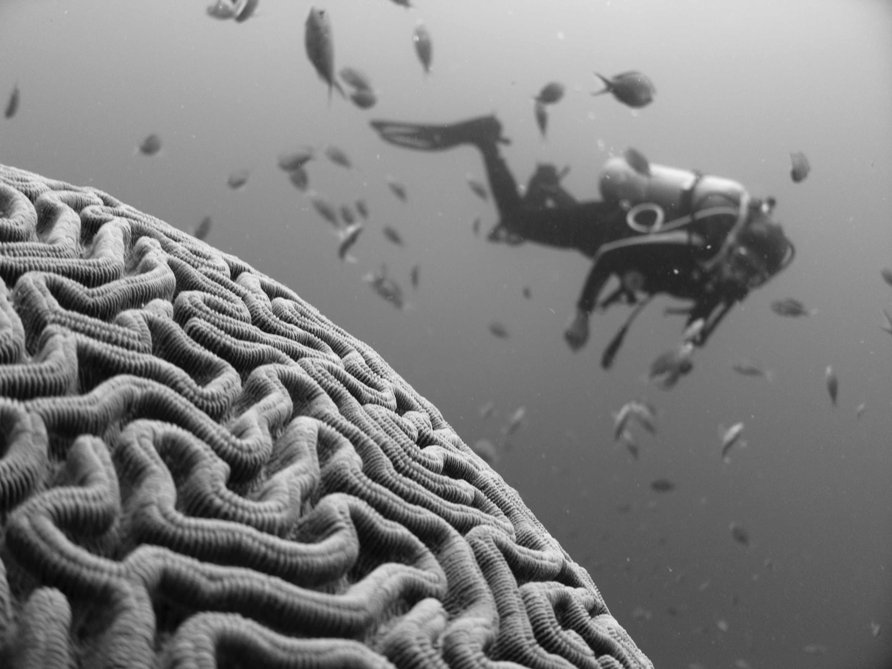
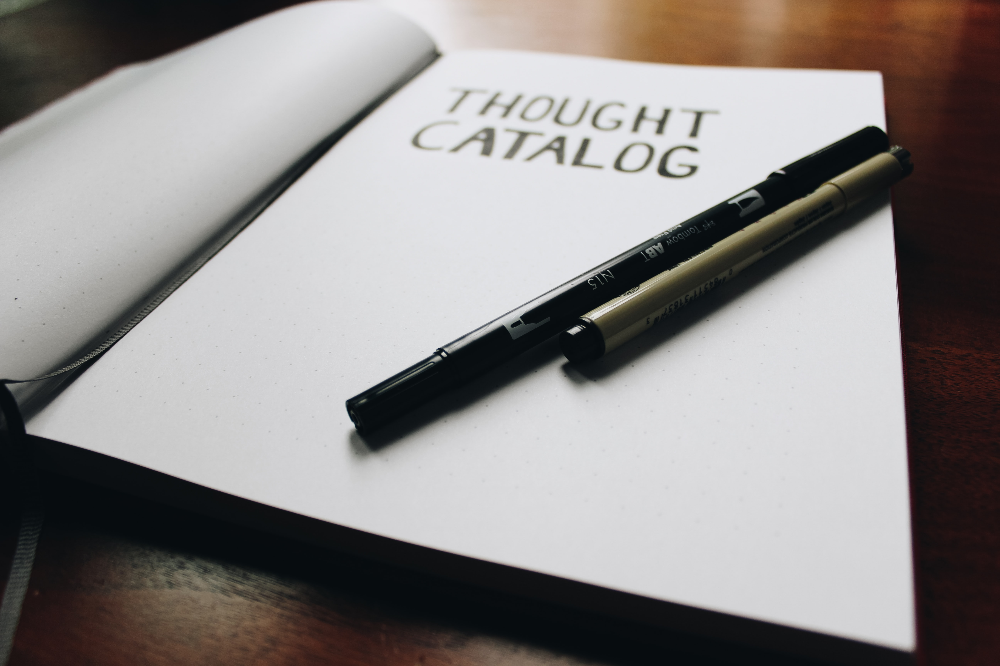

Bazen bir işimizde hata yapar ve kendimizi günlerce hırpalarız. Yetersiz bir insan olduğumuzu düşünüp dururuz veya durumun umutsuz vaka olduğu düşüncesine saplanırız. Bir şanssızlık yaşadığımız zaman, kötü şeylerin özellikle bizim başımıza geldiğini düşünürüz, "Hep beni bulur böyle şeyler" deriz. Hemen hemen her cümleden anlayabileceğimiz gibi bunlar olumsuz düşüncelerdir ve çoğunlukla düzeltebileceğimiz basit **düşünce hatalarından** kaynaklanır. Bu yazıda sizlere bu hataları tanıtmaya ve nasıl daha doğru düşünebileceğimize örnekler vermeye çalışacağım.

## Düşünce hataları nedir?

İnsanların başlarına gelen olaylara karşı takındıkları tavır ve tutumlar farklılık göstermektedir. Çok büyük sıkıntılar çektikten sonra hala umudunu kaybetmeyen bir insanla, küçük bir aksiliği büyütüp tüm gününü sinirli bir halde geçiren birinin arasındaki fark büyük ölçüde bu insanların bakış açılarından kaynaklanmaktadır. Kişinin kendisine, başka insanlara ve olaylara dair sahip olduğu önyargılı bakış açılarına **düşünce hataları** ya da **bilişsel çarpıtmalar** denir. Bunlar zaman içinde farkında olmadan pekiştirdiğimiz mantıksız düşünceler ve inançlardır. Herkes zaman zaman düşünce hataları yapabilir, bu çok normaldir. Ancak sürekli hale geldiklerinde çoğu zaman kendimizi ve dünyayı daha olumsuz algılamamıza neden olurlar ve hayattan zevk almamızı engellerler. Akıl sağlığımıza zarar verir; stres, anksiyete ve depresyona yol açabilirler. Genelde düşünce hataları günlük hayatımıza o kadar işlemiştir ki otomatik düşünceler olarak kendilerini gösterirler ve biz onları hiç sorgulamadan kabul ederiz. Ancak yanlış düşündüğümüzü fark ettiğimizde, bu gibi düşünme kalıpları etkisini büyük ölçüde yitirecektir. Bu nedenle bu tarz hatalı düşüncelerin farkında olmak önemlidir.

## Düşünce hatası yapıyor musunuz?

Düşünce hatalarına meydan okuyacak yöntemlere bakmadan önce düşünce hatası yapıp yapmadığınızı anlamak için kendinize sorabileceğiniz sorulara bakalım:

* Fazla düşünmeden hızlı bir şekilde bir sonuca mı varıyorum?
* Başkalarının aklını mı okuyorum?
* Kendi görüşümün tek doğru görüş olduğunu mu düşünüyorum?
* Olayların sadece olumsuz tarafına mı bakıyorum?
* Olumsuz bir olayın gerçekleşme ihtimalini gözümde büyütüyor muyum?
* Bir durumu değiştirmek için elimden hiç bir şey gelmeyeceğini mi düşünüyorum?
* Olayların önemini abartıyor muyum?
* Kendimden ya da başkalarından mükemmel ve kusursuz olmalarını mı bekliyorum?
* Olayları oldukları gibi kabul etmek yerine nasıl olmaları gerektiğini düşünüp kendimi yıpratıyor muyum?
* Benim hatam olmayan bir durumdan dolayı kendimi mi suçluyorum?
* Ya hep ya hiç şeklinde mi düşünüyorum?
* Düşüncelerimde hep -meli /-malı ifadeleri mi kullanıyorum?
* Benimle alakası olmayan şeyleri kişisel mi algılıyorum?
* Sürekli zayıflıklarıma odaklanıp güçlü yanlarımı ihmal mi ediyorum?

Diyelim ki bu soruları sorduk ve bazı düşünce hatalarını yaptığımızı fark ettik. Bu noktada "Bu farkındalık ne işimize yarayacak?" diye sorabilirsiniz. Yukarıda değindiğimiz gibi bir sorunun farkına vardığımızda bu sorun hayatımızdaki gücünü kaybetmeye başlar. Bilinç seviyesine getirdiğiniz her sorun ile ilgili kontrol gücünüz oluşur ve hayatınızın yolcu koltuğundan sürücü koltuğuna geçersiniz. ⁣

## Düşünce hatalarına meydan okuyacak bir kaç yöntem

### 1- Etiketleri kaldırın

Eğer kendinizi "Ben tam bir aptalım." veya başka birisi için "O umutsuz bir vaka." derken buluyorsanız, bu tarz bir etiketlemenin bugüne kadar sorunu çözme konusunda faydasını görüp görmediğinizi kendinize sorun. Cevap muhtemelen hayır olacaktır. Kendinize ve başkalarına çok kolay bir şekilde iliştirdiğiniz etiketler sizin sorunu çözme konusundaki motivasyonunuzu artıyor mu yoksa sizi demotive mi ediyor? Bu etiketleri kullanmak stres seviyenizi düşürüyor mu yoksa artırıyor mu?

Öncelikle kendinize bu etiketlerin ne kadar gerçekçi olduğunu sorun. Bunlar doğru tanımlar mı? Mesela, tam bir aptal olmak için her gün ve her şeyde ahmakça davranıyor olmanız gerekir ve bu imkansıza yakındır. Onun yerine "Toplantıda aptalca davranmış olabilirim ama bu benim tamamıyla bir aptal olduğumu göstermez." demek daha gerçekçi olacaktır.

Eğer etiketlemeyi çok yapıyorsanız, bunun en kolay çözümü, istemediğiniz bir durum olduğu zaman öncelikle insanları ya da kendinizi etiketlemek yerine **fark ettiğiniz davranışı ya da durumu objektif olarak tanımlamaktır.**

Örneğin,

* "Erkek arkadaşım çok ilgisiz biri." yerine "Erkek arkadaşım bana biraz ilgisiz davrandı.",
* "Ben başarısız biriyim." yerine "Bu sınavda başarılı olamadım.",
* "Yöneticim yaptığım işi beğenmiyor" yerine "Yöneticim bana işimi daha iyi yapabilmem için geri bildirim verdi."

şeklinde düşünmek bize fayda sağlayacaktır.

Çoğu zaman etiketler kendimizi daha kötü hissettirir ve problemin çözülmesinin önünde bir engel oluşturur. Mesela "Ben başarısız biriyim." cümlesi kişinin hep başarısız olacağını ve bu durumu değiştiremeyeceği algısını verir ve kişiyi depresif, çaresiz ve umutsuz hissettirebilir. Ancak "Bu sınavda başarılı olamadım." cümlesi çok daha az duygu yüklüdür ve sadece durumu tanımlar. Kişi bu durumu değiştirmenin elinde olduğunu fark eder ve daha sakin bir şekilde çözüme odaklanır - örneğin bir sonraki sınavda başarılı olmak için daha çok çalışır.

### 2-Daha dengeli bir bakış açısı edinin

Eğer bir durumu korkunç ya da mükemmel gibi uç noktalarda terimlerle değerlendirme eğiliminiz varsa dengeli düşünmek yani orta yolu bulmak bu olayları daha faydalı bir bakış açısında tutmaya yardımcı olacaktır. Çünkü çoğu zaman insanlar ve olaylar onları uç kavramlarla tanımlamak için fazla karmaşıktır. Örneğin, "Ben bu işi asla bitiremeyeceğim" diye düşünüyorsanız daha önce bitirdiğiniz işleri ve bu işin yapabileceğiniz kısımlarını düşünmek size farklı bir bakış açısı sağlar. "Bir rapor hazırlayacağım ve göndereceğim. Mükemmel olmasa bile yöneticim için yeteri kadar iyi olacaktır." diye dengeli düşünmek zihinsel açıdan yükünüzü azaltır.

### 3-Kendinizle arkadaş olun

Bu yöntem olumsuz düşüncelerle baş etme konusundaki en güçlü düşünce yöntemlerinden biri olabilir. Çoğu zaman sevdiğimiz insanlara karşı kendimize olduğumuzdan daha nazik ve anlayışlı oluruz. Eğer önemli bir hata yaptıysanız, aynı hatayı arkadaşınız yapsaydı ona ne söylerdiniz diye düşünün. Büyük ihtimalle arkadaşınıza karşı kendinize olduğunuz kadar eleştirel olmazdınız ve onunla daha yumuşak ve nazik konuşurdunuz. Şimdi arkadaşınıza göstereceğiniz bu anlayışı ve şefkati kendinize de gösterdiğinizi hayal edin.

Benzer bir yöntem de aklınıza hayata karşı daha pozitif bir bakış açısına sahip olan bir arkadaşınızı ya da kişiyi getirmek ve bu kişi sizin yerinizde olsaydı yaşadığınız problemi nasıl ele alırdı diye düşünmektir.

Neşeli ve olaylara olumlu bakmasıyla meşhur bir arkadaşınızı düşünün. O sizin yerinizde olsaydı bu probleme nasıl tepki verirdi? Onun tutumu nasıl olurdu? Nasıl başa çıkardı?

### 4-Durumu abartmak yerine doğru bir şekilde değerlendirin

Bir durumu olduğundan daha fazla büyütmek çok kolaydır ama bu sadece stres seviyemizin artmasını sağlar. Kendinize şunu sorun: "Bu gerçekten bu kadar korkunç mu?", "Dünyanın sonu mu?". Durumu inceleyerek ve doğru bir şekilde değerlendirerek stres seviyenizi azaltabilirsiniz.

"Trenimi kaçırdım ve toplantıya geç kalıyorum, her şey bitti!" şeklinde düşünmek yerine "Treni kaçırdım en iyisi toplantıya geç kalacağımı iş arkadaşlarıma haber vereyim." diye düşünmek sizi rahatlatacaktır.

### 5-Daha esnek düşünün

Katı ve değişmez inançlar kişide yüksek seviyede stres yaratabilir. Mesela, "Çocuğum en iyi liseyi kazanmalı." gibi bir düşünce sadece kişinin kendisine stres yaratmakla kalmaz, çocuğu için de bir baskı yaratır. Oysa "Çocuğum iyi bir liseye gitsin isterim ama önemli olan sağlığı ve mutluluğu." düşüncesi bir önceki düşünceden daha az stres yüklüdür. Diğer bir deyişle, düşünce repertuarınıza -bunlar istek ve tercihler olabilir- daha esnek ve gerçekçi inanışlar katmak üzerinizdeki stresi azaltacaktır.

Düşünce hatalarının farkında olmak, zaten karmaşık ve zor olan günlük yaşamda hepimizin sahip olması gereken önemli bir araçtır. Yukarıda listelediğimiz düşünce yöntemleriyle birleştirildiğinde, aynı iyi bir araç takımı gibi, basit bir arızayı büyümeden kolaylıkla çözmenizi sağlar.

Bu da ilginizi çekebilir: [En çok karşılaşılan 7 düşünce hatası: Siz hangilerine sahipsiniz?](https://www.gizemunlu.net/dusunce_hatalari)

Kaynak: 

Palmer, S. & Burton, T. (1996). Dealing with People Problems at Work. Maidenhead:McGraw-Hill.

Palmer, S, Cooper, C. & Thomas, K. (2003). Creating a Balance: Managing Stress, British Library.